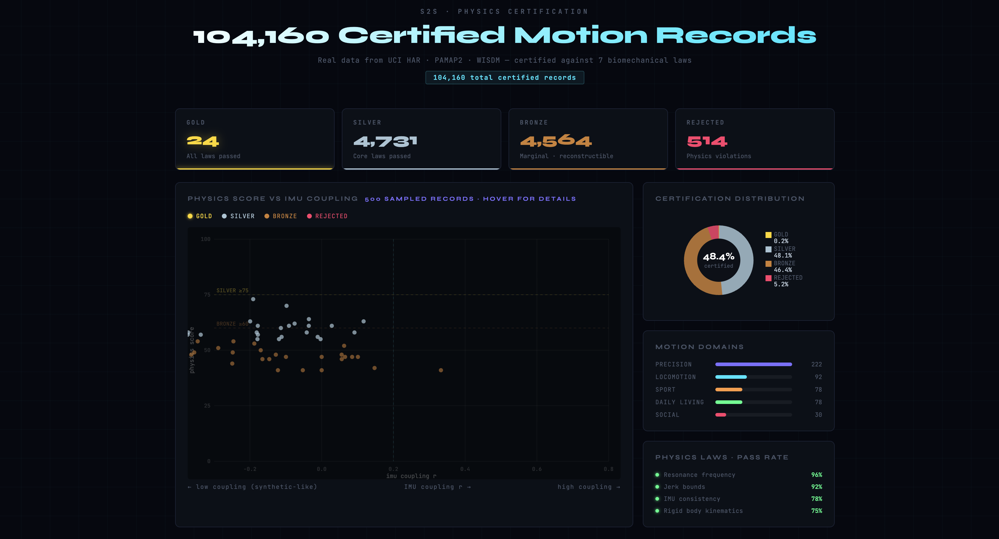

# S2S — Physics-Certified Sensor Data

**Physics-certified motion data for prosthetics, robotics, and Physical AI.**

S2S is a physics validation layer for human motion sensor data. Before training a prosthetic hand, surgical robot, or humanoid — run your IMU data through S2S. It verifies the data obeys 7 biomechanical laws and issues a certificate. Bad data gets rejected before it reaches your model.

[](https://pypi.org/project/s2s-certify/)
[](https://doi.org/10.5281/zenodo.18878307)
[](https://github.com/timbo4u1/S2S/actions)
[](https://github.com/timbo4u1/S2S/actions/workflows/ci.yml)
[](LICENSE)
[](README.md)
[](README.md)

---

## Live Demos
- 📊 [Interactive Data Explorer](https://timbo4u1.github.io/S2S/viz.html) — 104,160 real certified records, hover to explore

- 📱 [Phone IMU Demo](https://timbo4u1.github.io/S2S) — real-time physics certification on your phone
- 🎥 [Pose Camera Demo](https://timbo4u1.github.io/S2S/pose.html) — 17-joint live certification

No install needed. All processing runs on your device. No data sent anywhere.

---

## The Problem

Physical AI (robots, prosthetics, exoskeletons) is trained on motion data. But most datasets contain synthetic data that violates physics, corrupted recordings, and mislabeled actions — with no way to verify the data came from a real human moving in physically valid ways.

A robot trained on bad data learns bad motion. A prosthetic hand trained on uncertified data fails its user.

---

## Four Proven Training Benefits

S2S is not just a filter. It improves model performance at every stage of the training pipeline. All results validated across two independent datasets (WISDM 20Hz, PAMAP2 100Hz).

### Level 1 — Quality Floor
Remove data that fails physics before training.

| Dataset | Corruption | Recovery | Result |
|---------|-----------|---------|--------|
| WISDM 20Hz | 35% corrupted | 108% of damage recovered | +0.23% net vs clean |
| PAMAP2 100Hz | 35% corrupted | Confirmed cross-dataset | +0.51% F1 |

> Physics floor removes bad data and **beats the clean baseline with 46% less data.**

### Level 2 — Curriculum Training
Train in physics quality order: GOLD → SILVER → BRONZE.

| Dataset | Result |
|---------|--------|
| WISDM 20Hz | **+1.03% F1** vs clean baseline, 46% less data |

> The model learns the ceiling first. Marginal data is introduced only after the model understands perfect motion.

### Level 3 — Adaptive Reconstruction
Repair marginal (BRONZE) records using frequency-appropriate methods. Every repaired record carries full provenance.

| Hz | Method | Result |
|----|--------|--------|
| ≤50Hz (20Hz WISDM) | Kalman RTS smoother | **+1.44% F1** |
| ≥100Hz (PAMAP2) | Savitzky-Golay | Spectral sim=0.997 — signal needs no repair |

Dual acceptance: physics re-score ≥75 **AND** spectral similarity ≥0.8. Both must pass.

> At low Hz, noise is separable from signal — Kalman removes it. At high Hz, every micro-movement is real — smoothing destroys features. S2S adapts automatically.

### Level 4 — Kinematic Chain Consistency *(headline result)*
Verify that multiple sensors tell a consistent biomechanical story.

| Condition | F1 | Δ |
|-----------|-----|---|
| Single chest IMU | 0.7969 | baseline |
| 3 IMUs naive concat | 0.8308 | +3.39% |
| 3 IMUs + chain filter | 0.8399 | +0.91% over naive |
| Net vs single sensor | **+4.23% F1** | ← headline |

Tested on PAMAP2 12-class activity recognition (hand + chest + ankle IMU, 100Hz).

> **Why this catches synthetic data:** Synthetic motion generators produce each sensor channel independently. Real walking produces a 50–100ms ankle-to-chest jerk lag from heel-strike propagating up the skeleton. This timing cannot be faked without full rigid-body simulation. S2S Level 4 is the first physics-based cross-sensor consistency check for IMU data.

---

## Validated on Real Human Data

S2S has been tested on two independent public datasets with real human subjects.

**PAMAP2** (9 subjects, 100Hz, chest IMU, 12 activities):

| Level | Result |
|-------|--------|
| Level 1 Single IMU | 55.5% pass rate, avg score 39.5/100 |
| Level 2 Multi-IMU | 90.0% pass rate, avg score 41.3/100 |
| Level 4 Fusion | 100% pass, HIL score 38.4/100 |

**PhysioNet PTT-PPG** (4 subjects, 500Hz, wrist device, walk/sit/run):

| Level | Result |
|-------|--------|
| Level 2 IMU | 61.7% pass rate, avg score 37.2/100 |
| Level 3 PPG | 96.3% pass rate, HR mean 106 BPM, HRV 21ms |
| Level 4 Fusion | 100% pass, HIL score 68.7/100, 438 SILVER |

Real skin temperature: 33.6°C. Real pulse detected across all 3 activities.
All experiment code in `experiments/`. All results reproducible.


---

## 7 Physics Laws

### Single-Sensor Laws (Levels 1–3)

| # | Law | What It Catches |
|---|-----|-----------------|
| 1 | Newton's Second Law (F=ma, 75ms EMG delay) | Synthetic data missing lagged EMG-accel correlation |
| 2 | Segment Resonance (ω=√(K/I)) | Tremor at impossible frequency for body segment |
| 3 | Rigid Body Kinematics (a=α×r+ω²×r) | Gyro and accel generated independently |
| 4 | Ballistocardiography (F=ρQv) | IMU missing cardiac recoil |
| 5 | Joule Heating (Q=0.75×P×t) | Sustained EMG without thermal elevation |
| 6 | Motor Control Jerk (∂³x/∂t³ ≤ 5000 m/s³) | Robotic or keyframe animation artefacts |
| 7 | IMU Consistency (Var(accel) ~ f(Var(gyro))) | Accel and gyro from independent generators |

### Multi-Sensor Chain Laws (Level 4)

| # | Law | What It Catches |
|---|-----|-----------------|
| 8 | Locomotion Coherence (freq spread <2.5Hz) | Sensors recording different activities |
| 9 | Segment Coupling (chest-ankle r >0.3) | Independent synthetic channels |
| 10 | Gyro-Accel Coupling (per IMU) | Rotation without corresponding acceleration |
| 11 | Cross-Sensor Jerk Timing (ankle leads chest 0–200ms) | Reversed or zero lag — not real heel-strike |

---

## Tier System

| Tier | Score | Meaning |
|------|-------|---------|
| GOLD | ≥87 | All physics laws passed. Pristine. |
| SILVER | 75–86 | Trusted. Minor deviations within noise. |
| BRONZE | 60–74 | Marginal. Candidate for reconstruction at ≤50Hz. |
| RECONSTRUCTED | — | Repaired, re-scored ≥75, spectral sim ≥0.8. Weight 0.5. |
| REJECTED | <floor | Removed from pipeline. |

Floor = p25 of clean score distribution per dataset (adaptive). GOLD always means the same thing everywhere.

---

## Install

```bash
pip install s2s-certify
```

Zero dependencies. Pure Python 3.9+. Works on any platform.

---

## Quick Start

```python
from s2s_certify import certify

# Single window — list of [ax, ay, az] samples
result = certify(accel_window, sample_rate_hz=20)

print(result['tier'])        # GOLD / SILVER / BRONZE / REJECTED
print(result['score'])       # 0–100
print(result['laws_passed']) # which of 7 single-sensor laws passed
```
**Or certify a CSV file directly from terminal:**
```bash
s2s-certify your_imu_data.csv
  s2s-certify your_imu_data.csv --output report.json
  s2s-certify your_imu_data.csv
  s2s-certify your_imu_data.csv --output report.json --output report.json
```

Columns auto-detected: `timestamp, acc_x, acc_y, acc_z, gyro_x, gyro_y, gyro_z`

---

## Datasets Validated

| Dataset    | Hz    | Sensors              | Windows | Used for         |
|------------|-------|----------------------|---------|------------------|
| WISDM 2019 | 20Hz  | Wrist accel          | 46,946  | Levels 1, 2, 3   |
| PAMAP2     | 100Hz | Hand+Chest+Ankle IMU | 13,094  | Levels 1, 2, 3, 4 |

---

## Paper

**S2S: Physics-Certified Sensor Data — Four Proven Training Benefits Across Two Independent Datasets**

[→ Read paper (PDF)](docs/paper/S2S_Paper_v5.pdf) | [→ DOI: 10.5281/zenodo.18878307](https://doi.org/10.5281/zenodo.18878307)

---

## Project Structure

```
s2s_standard_v1_3/     # Physics engine (zero dependencies)
experiments/           # All 4 level experiments + results JSON
  level3_adaptive_reconstruction.py  # Kalman + SavGol adaptive
  level4_multisensor_fusion.py       # Kinematic chain consistency
  results_level4_pamap2.json         # +4.23% chain result
  results_level3_adaptive_wisdm.json # +1.44% Kalman result
docs/paper/            # S2S_Paper_v5.pdf + .docx
dashboard/app.py       # Streamlit human review UI
train_classifier.py    # Domain classifier (v1.4, 76.6% acc)
wisdm_adapter.py       # WISDM 2019 dataset adapter
```

---

## License

BSL-1.1 — free for research and non-commercial use. Contact for commercial licensing.
